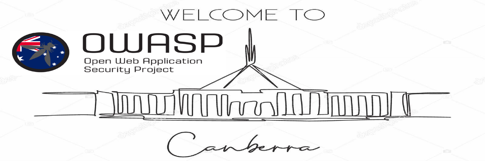

---

layout: col-sidebar
title: OWASP Canberra
tags: Canberra
region: Oceania
meetup-group: OWASP-Canberra-Chapter
country: Australia
postal-code: 2600

---



## Welcome
Welcome to the Canberra Chapter of OWASP home page!

The OWASP Canberra Chapter was active in 2013 and was rebooted in 2020. We are aiming to organise local events throughout the year.

The chapter leaders are Toby Amodio & Akshay Gupta.

## Our Goals

# Equality
We aim to bring together people from research, academia and industry to motivate, and empower others to pursue a career in cybersecurity. By raising awareness against discrimination within the workforce, we work towards increasing diversity and equality in cybersecurity.

# Education
We are committed to helping discover the next generation of cybersecurity talent. We aim to offer mentorship programs to educate those new to cybersecurity, and provide talks from industry professionals to showcase all cybersecurity has to offer.

# Community
We want to help you connect with like-minded individuals. Whether you are new to cybersecurity or a seasoned veteran, our goal is to build a community where everyone can openly discuss and explore current issues in cybersecurity, employment opportunities and more. By providing networking opportunities, we want everyone to get involved in the community and establish relationships with new people.

# Industry Insights
No cybersecurity professional would feel complete without latest Industry insights and we will aim to hold various Industry leaders led sessions/talks from time to time.

# Interested In Speaking?
We are always open to speakers who want to present a talk that aligns with our Chapter goals. If you are interested, please email your proposed topic, abstract, and brief speaker bio to [Akshay Gupta](mailto:Akshay.Gupta@owasp.org).

# Upcoming Events!
Please join our meetup group to stay updated on latest events. Our next event will be scheduled soon via Zoom in last week of April 21. Details to follow.

# Participation
The Open Web Application Security Project (OWASP) is a nonprofit foundation that works to improve the security of software. All of our projects ,tools, documents, forums, and chapters are free and open to anyone interested in improving application security. 

Everyone is welcome and encouraged to participate in our [Projects](/projects), [Local Chapters](/chapters), [Events](/events), [Online Groups](https://groups.google.com/a/owasp.com/){:target='_blank'}, and [Community Slack Channel](https://owasp.slack.com/){:target='_blank'}. We especially encourage diversity in all our initiatives. OWASP is a fantastic place to learn about application security, to network, and even to build your reputation as an expert. We also encourage you to be [become a member](/membership) or consider a [donation](/donate) to support our ongoing work.

## Sponsor our Chapter
If you are interested in sponsoring our chapter or an event , please contact us via email.

# Contact
Please feel free to contact Akshay Gupta via Akshay.Gupta@owasp.org for all enquiries.


```
{info.md}

This separate file is where you should place links to your Google Group and Meetup page. It will be automatically rendered in the column sidebar.

{leaders.md}

Another separate file that should simply include each leaders name with mailto link as a list. It will also be automatically rendered in the column sidebar.

-->
